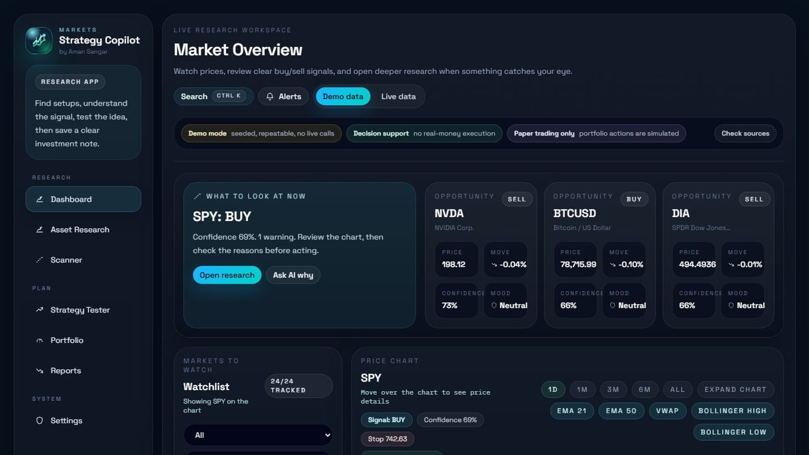
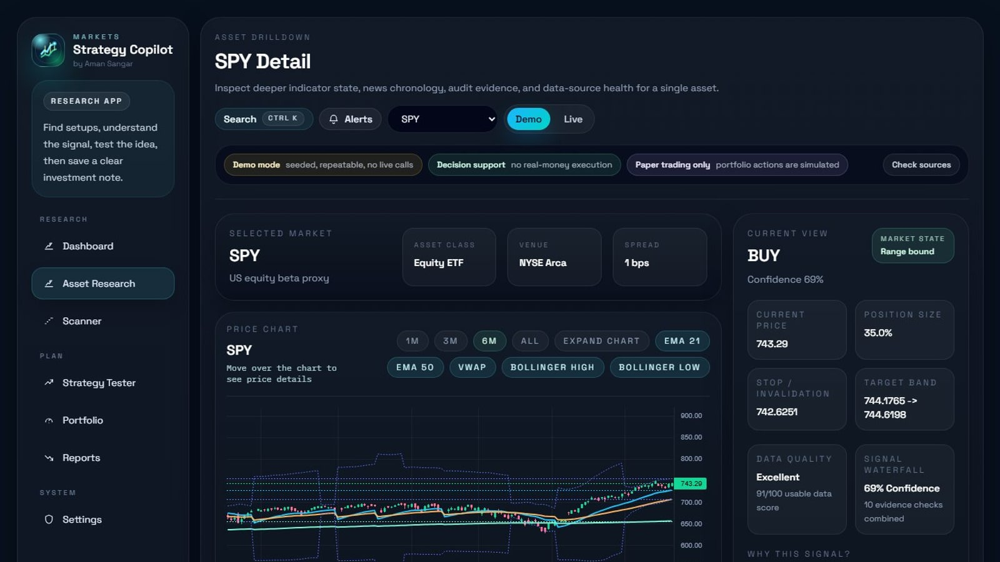
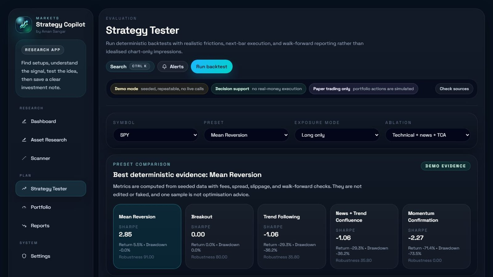
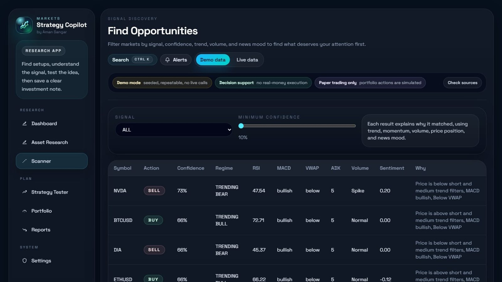
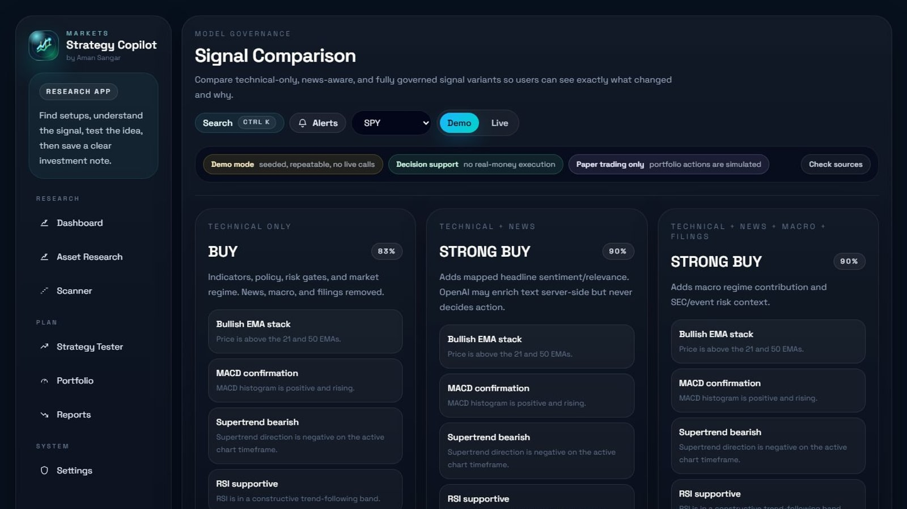
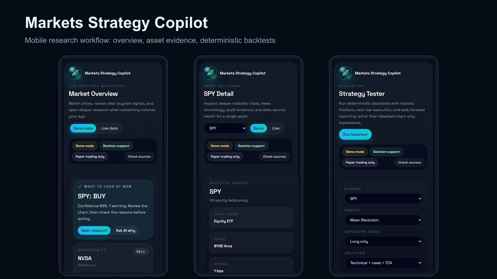

# Markets Strategy Copilot

Markets Strategy Copilot is a local-first market research and decision-support terminal. It combines deterministic technical signals, provider health visibility, news and filing context, TCA-aware backtesting, paper portfolio views, audit logging, and PDF investment-note export.

It is not an auto-trading bot. The app does not place real-money orders, and it must never expose API keys in the browser or in release packages.

## Product Screenshots



| Research workflow | Strategy evidence |
| --- | --- |
|  |  |

| Signal discovery | Governance |
| --- | --- |
|  |  |



## Latest Product Enhancements

- Instant demo launchpad with readiness score and product walkthrough.
- Data quality scoring on every signal so users can see freshness, provider, policy, and risk confidence.
- Signal waterfall explanation showing the deterministic contribution behind confidence changes.
- Demo-first startup for safe assessment runs, with clear opt-in Live mode and visible fallback when critical APIs or internet access fail.
- Signal Quality dashboard covering directional action distribution, confidence bands, confidence-reduction reasons, and audit coverage.
- Model Governance page comparing technical-only, news-aware, and fully governed signal variants.
- Universe Builder and dashboard watchlist controls for local cross-asset universe selection.
- Data Coverage map showing bars, news, filings, signals, backtests, and evidence gaps by asset.
- Strategy Matrix comparing all presets side-by-side with TCA-aware metrics and robustness scores.
- Read-only Research Assistant over local signal/news/risk/governance context with server-side OpenAI fallback support.
- Offline mode banner so internet outages are explicit and Demo-safe behavior is clear.
- Chart UX upgrades for quick ranges, focus mode, overlay toggles, and OHLC crosshair readout.
- Beginner Setup Guide with first-run tutorial, safe command reference, provider failover timeline, and one-click demo cache warmup.
- Cached demo dashboard path for faster local demos without changing live-mode freshness rules.
- Provider fallback priority cards for market data, news, fundamentals, macro, filings, and enrichment.
- Stronger PDF investment notes with data-quality and confidence-waterfall sections.
- Portfolio risk heatmap for exposure, concentration, and P&L risk review.
- Backtest robustness panel with fold consistency, drawdown sensitivity, and cost-drag warnings.
- Market replay scenario shortcuts for breakout, risk-off, mean-reversion, and news/event review.
- Command palette launcher for fast keyboard-friendly navigation.
- System readiness panel on dashboard/settings covering artefacts, audit, provider transparency, and demo safety.
- TradingView-inspired research terminal modules: multi-chart layout, chart drawing overlays, pattern confluence, comparison/correlation, and saved chart layouts.
- Pine-lite strategy builder for safe rule prototyping before scanner/backtest use.
- Advanced alert builder with cooldowns, provider outage templates, filing-event alerts, and safe delivery policy.
- Market Replay Lab with cursor-based bars, news, filings, and signal timeline evidence.
- Koyfin-style tear sheets and event calendar for macro, earnings, filings, and news context.
- Ranked opportunity radar with custom scanner columns and "why this ranked" explanations.
- Professional Research Toolkit covering premium-app-inspired research modules: model portfolios, heatmaps, risk navigator, stress tests, learning centre, data lineage, evidence pack, and API-key guidance.
- Original in-app logo and global status strip branded `by Aman Sangar`.

## Stack

- Frontend: Next.js, React, TypeScript, Tailwind CSS, shadcn-style UI primitives
- Backend: FastAPI, Python 3.11, SQLAlchemy, Pydantic
- Persistence: PostgreSQL for normal local dev, SQLite-compatible test/dev override
- Charts: TradingView Lightweight Charts with in-app attribution
- Testing: pytest, TypeScript, ESLint, Playwright
- Packaging: source-only submission ZIPs through `scripts/package_submission.py`, plus optional evidence/review ZIPs through `scripts/package_release.py`

## Project Layout

- `apps/web` - Next.js frontend
- `apps/api` - FastAPI backend
- `packages/shared` - shared frontend/backend contracts
- `data/demo` - deterministic demo inputs and policy config
- `docs` - architecture, indicators, providers, security, testing, user guide, traceability
- `scripts` - checks, seeding, smoke tests, artefact generation, packaging
- `artefacts` - generated local evidence and exports. The app creates this folder automatically; the source submission ZIP includes only `.gitkeep` markers so screenshots, PDFs, local databases, and metrics can be regenerated on another machine.

Screenshot evidence is indexed in `docs/screenshots.md`, including full-page desktop/mobile screenshots and before/after feature activation states.
Screenshots and PDFs are useful review artefacts, but the clean source submission package does not require them to exist before the app starts.

## Install

Use Node.js 20+ and Python 3.11.

```powershell
npm install --workspaces --include-workspace-root
python -m pip install -e "./apps/api[dev]"
python scripts/generate_demo_data.py
```

If PowerShell cannot find `npm`, open a fresh terminal after installing Node.js or run it through `C:\Program Files\nodejs\npm.cmd`.

If npm 11/Node 24 reports `Invalid Version` during a workspace install on Windows, use the local web fallback below. The repo checks and smoke scripts support this layout:

```powershell
cd apps/web
npm install --workspaces=false --include=dev --ignore-scripts --no-audit --no-fund
cd ../..
python -m pip install -e "./apps/api[dev]"
python scripts/generate_demo_data.py
```

## Local Performance Notes

Use Python 3.11 for the API. On Windows, the `python` launcher can sometimes resolve to an older Microsoft Store Python; the smoke/check scripts now prefer a standard local Python 3.11 install when it exists, then fall back to the active interpreter.

Next.js development builds can feel slow inside cloud-synced folders because `.next` files are watched and occasionally locked by sync/indexing. For a faster local demo, use the production-style smoke path (`python scripts/run_smoke.py demo`) or build once and run the production Next server. A future Windows installer can improve perceived startup by bundling a production build and avoiding dev compilation, but it will not make provider network calls or heavy backtests instantaneous.

## Start Locally

Fast supervisor demo path:

```powershell
cd "<path-to-your-markets-copilot-folder>"
.\scripts\prepare_demo.ps1
.\scripts\start_demo.ps1
```

`prepare_demo.ps1` is the slower first-time step: it installs missing web dependencies if needed, regenerates seeded demo data, and builds the production frontend once. `start_demo.ps1` then starts FastAPI and the production Next server in separate windows, warms the demo caches, and opens `/demo` automatically. For repeat demos, run only:

```powershell
.\scripts\start_demo.ps1 -SkipBuild
```

Docker path:

```powershell
npm run dev
```

Manual path:

```powershell
cd apps/api
python -m uvicorn app.main:app --reload --host 127.0.0.1 --port 8000
```

In a second terminal:

```powershell
cd apps/web
$env:NEXT_PUBLIC_API_BASE_URL="http://127.0.0.1:8000"
npm run dev
```

Local URLs:

- Frontend: `http://127.0.0.1:3000`
- Backend API: `http://127.0.0.1:8000`
- API docs: `http://127.0.0.1:8000/docs`
- Demo status: `http://127.0.0.1:8000/api/v1/system/status?mode=demo`

## Commands

```powershell
npm run check
npm run smoke:demo
npm run smoke:live
npm run screenshots:final
npm run package:submission
npm run demo:prepare
npm run demo:start
npm run web:typecheck
npm run web:test:e2e
npm run web:test:e2e:headed
npm run package:release
python scripts/package_chatgpt_review.py
```

Equivalent direct commands:

```powershell
python scripts/run_checks.py
python scripts/run_smoke.py demo
python scripts/run_smoke.py live
cd apps/web; node scripts/capture_final_screenshots.mjs; cd ../..
python scripts/package_release.py
python scripts/package_chatgpt_review.py
python scripts/package_submission.py
```

## Routes

Main workflow routes:

- `/` - Dashboard
- `/asset/SPY` - Asset research detail
- `/scanner` - Scanner
- `/strategy-tester` - Strategy tester
- `/portfolio` - Local paper portfolio and optional Alpaca paper sync status
- `/reports` - Reports and PDF investment notes
- `/settings` - Provider, licensing, security, and system status

Advanced and evidence routes remain available for assessment, deeper research, and power users. They are intentionally kept out of the main sidebar so the daily workflow stays focused:

- `/assistant` - Read-only research assistant over local app evidence
- `/alerts` - Alert center
- `/workspace` - Guest/local workspace, saved watchlists, scanner presets, notes
- `/demo` - Guided supervisor demo launchpad
- `/setup` - Beginner setup guide, tutorial, commands, and provider failover timeline
- `/quality` - Signal-quality evidence dashboard
- `/governance` - Signal comparison and model-governance view
- `/coverage` - Data coverage and evidence map
- `/universe` - Local watchlist/universe builder
- `/terminal` - Multi-chart terminal, comparison/correlation, drawing overlays, saved layouts
- `/opportunities` - Ranked opportunity radar and custom scanner columns
- `/strategy-builder` - Pine-lite rule builder for deterministic strategy candidates
- `/strategy-matrix` - Preset comparison matrix
- `/replay-lab` - Market replay lab with historical cursor and event markers
- `/tear-sheet` - Company/asset tear sheet with macro, filings, news, and fundamentals context
- `/events` - Economic, earnings, filing, and news calendar
- `/alert-builder` - Advanced explainable alert builder
- `/pro-terminal` - Advanced feature console, risk navigator, learning, lineage, and evidence tools

The Codex in-app browser and Playwright can test the unauthenticated routes above. If Clerk sign-in is enabled, test actual sign-in flows manually in a normal browser because embedded/in-app browsers can be unreliable for hosted auth redirects.

## Environment Variables

Copy `.env.example` to `.env` and fill values locally. Never paste `.env` contents into chat, screenshots, logs, PDFs, or release packages.

Core live integrations:

- `OPENAI_API_KEY`
- `POLYGON_API_KEY`
- `NEWSAPI_API_KEY`

Optional market, macro, and filing integrations:

- `APCA_API_KEY_ID`
- `APCA_API_SECRET_KEY`
- `FRED_API_KEY`
- `SEC_USER_AGENT`
- `FINNHUB_API_KEY`
- `ALPHAVANTAGE_API_KEY`
- `FMP_API_KEY`
- `TWELVEDATA_API_KEY`
- `MARKETAUX_API_KEY`
- `EODHD_API_KEY`

Optional product integrations:

- `NEXT_PUBLIC_CLERK_PUBLISHABLE_KEY`
- `CLERK_SECRET_KEY`
- `RESEND_API_KEY`
- `RESEND_FROM_EMAIL`
Only `NEXT_PUBLIC_*` variables are allowed to reach the browser. All provider keys, secret auth keys, and email keys stay server-side.

## Demo And Live Modes

The browser starts in Demo mode on a fresh session so markers and first-time users see deterministic seeded data before opting into live providers. Live mode still works with configured external keys and keeps fallback/degraded states visible.

Live mode uses configured providers where available. Provider status is surfaced as `configured`, `healthy`, `degraded`, `missing`, `disabled`, or `manual-check-needed`; `healthy` is reserved for a successful lightweight check. If critical live market/news requests fail because an API or internet connection is unavailable, the frontend can show a visible demo-data fallback notice while keeping the selected mode clear.

## Packaging

Create a clean source submission ZIP:

```powershell
python scripts/package_submission.py
```

This source package is the safest ZIP to submit when the marker needs to run the code from scratch. It includes source code, docs, scripts, tests, `data/demo`, `.env.example`, Dockerfiles, and empty `artefacts/.gitkeep` markers. It excludes generated screenshots, PDFs, seeded metrics, audit extracts, provider-health JSON, release ZIPs, local databases, caches, `.next`, `node_modules`, and `.env`.

Create an optional evidence/review ZIP after regenerating artefacts:

```powershell
python scripts/package_release.py
```

The evidence packager validates the ZIP and excludes `.env`, `.env.*`, `.git`, `.next`, `node_modules`, local databases, caches, logs, Playwright traces/reports, and runtime junk. `.env.example` is intentionally included because it contains names only and no secrets.

Before packaging a final review build, regenerate the evidence pack:

```powershell
python scripts/generate_artefacts.py
npm run screenshots:final
python scripts/package_release.py
python scripts/package_chatgpt_review.py
```

The release validator fails if the sample PDF, seeded metrics, audit extract, provider health artefacts, strategy comparison artefacts, completion evidence doc, or final screenshots are missing.

The app itself does not depend on generated artefacts. Report export creates `artefacts/exports/` automatically, demo data can be regenerated with `python scripts/generate_demo_data.py`, and local SQLite databases are runtime files that must not be submitted.

## Recommended Marker Walkthrough

1. Open `http://127.0.0.1:3000` and confirm Demo mode is clearly labelled.
2. Open `/asset/SPY` to inspect the chart, signal, replay, news, filings, audit trail, and source health.
3. Open `/scanner` and review populated scanner results.
4. Open `/strategy-tester`, run a deterministic backtest, and inspect metrics/trades.
5. Open `/reports` and export an investment note PDF.
6. Open `/portfolio` for local paper portfolio exposure and P&L.
7. Open `/settings` to verify provider configuration, health checks, and packaging safety.
8. Inspect `artefacts/` for screenshots, seeded metrics, provider health evidence, audit extract, and the sample PDF.

## Documentation

- [Requirements traceability](docs/requirements-traceability.md)
- [Provider matrix](docs/provider-matrix.md)
- [Provider troubleshooting](docs/provider-troubleshooting.md)
- [Licensing and limitations](docs/licensing-and-limitations.md)
- [Security](docs/security.md)
- [Observability](docs/observability.md)
- [Testing](docs/testing.md)
- [Windows installer roadmap](docs/windows-installer-roadmap.md)
